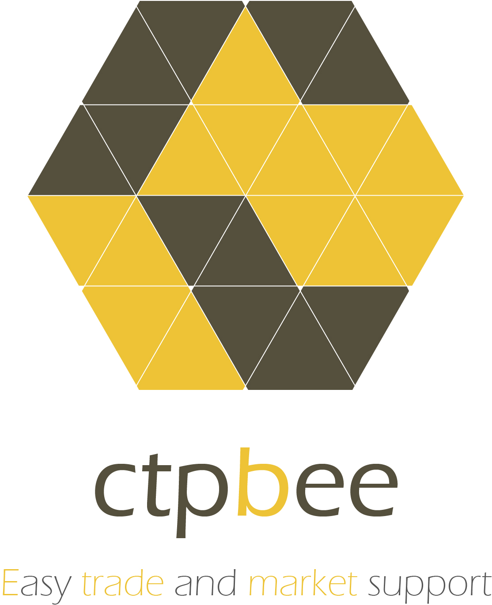

# ctpbee 
bee bee .... 为二次开发而生 ~~ 

>  tiny but strong




ctpbee 提供了一个可供使用的交易微框架, 你可以通过这个微小的核心来构建值得信赖的工具， 
当然这需要你的编程功力。 你所需要关心的是如何编程来处理行情和交易信息即可。

## 开始之前 
```bash
# just for linux/ 生成中文环境
sudo ctpbee -auto generate
```
## 起源

- 衍生自 [vnpy](https://github.com/vnpy/vnpy) 和 [flask](https://github.com/pallets/flask)  

## 安装 
```bash
# code install 
git clone https://github.com/ctpbee/ctpbee && cd ctpbee && python3 setup.py install  

# pip install
pip3 install ctpbee
```

## docker 快速部署

```
docker pull yutiansut/ctpbee:latest
docker run -p 5000:5000 yutiansut/ctpbee:latest
```

it will be fix in next version

## 文档
文档中描述相关教程，请认真阅读。如有问题，请到底部加群或者邮件联系作者 ^_^
[文档](http://docs.ctpbee.com)

## 社区支持
[地址](http://community.ctpbee.com)
    
    
## 功能支持

- [x] k线数据支持/home/somewheve/Templates
- [x] 分时图数据支持
- [x] 交易支持
- [x] 行情支持 --> 需要自己编写相应的数据库写入代码。
- [x] 自由自在的发单方式
- [x] 多账户支持
- [x] 支持申请穿透式接口
- [x] 快速下单助手
- [x] 风控层建立
- [x] 跟单信号
- [x] 多路行情对比 --> [looper_me](https://github.com/ctpbee/looper_me)
- [x] 数据快速支持 --> [ctpbee_converter](https://github.com/ctpbee/data_converter)
- [x] cta support 
- [x] 回测系统搭建  --> interface/looper


## 插件支持

- [ ] 套利 ---> ready to support
- [ ] 历史数据 support 


## QA_SUPPORT
当前针对[QUANTAXIS](http://github.com/QUANTAXIS/QUANTAXIS)的数据对接!
ctpbee作为开发框架并不具有历史数据的功能，我们也因为条件所限无法提供，**但是现在这些都不是问题**
我们提供了QA_SUPPORT版本支持，能让你轻松通过几个命令来获取历史数据。
> 此处感谢[QA作者yutiansut](https://github.com/yutiansut)，阻止了我重复造轮子

关于此个版本的支持，请参见[文档](https://docs.ctpbee.com/)中的[安装](https://docs.ctpbee.com/install)


## 一些可能会减少你工作量的工作
- [x] 7×24小时无人值守 (可选)
- [x] 定时查持仓和账户信息  (可选)
- [x] 策略对应订阅行情 (可选)
- [x] 对接多种指标计算                     
- [ ] 优化代码  / Hope for your work ^_^

## 快速开始 
```python
from ctpbee import CtpBee
app = CtpBee("ctpbee", __name__) 
info = {
    "CONNECT_INFO": {
        "userid": "",
        "password": "",
        "brokerid": "",
        "md_address": "",
        "td_address": "",
        "appid": "",
        "auth_code": "",
        "product_info":""
    },
    "INTERFACE":"ctp",
    "TD_FUNC": True,  # 开启交易功能 
}
app.config.from_mapping(info)  # 从dict中载入信息 对于更多配置载入方式, 请参阅文档或者阅读代码
app.start() 
```


## 发展计划
ctpbee主要面对开发者, 希望能得到各位大佬的支持. 后续不再开发examples. 
策略以及指标等工具都以ctpbee_** 形式发布. ctpbee只提供最小的内核. 本人崇尚开源, 无论你是交易者还是程序员, 只要你有新的想法以及对开源感兴趣, 欢迎基于ctpbee 开发出新的可用工具. 我会维护一个工具列表, 指引用户前往使用. 


## 社区激励计划 
emmmmmmmm，本来不想开通这个捐赠计划的，但是考虑到后期持续发展... 算了话不多说，
此计划是接受捐赠然后对于社区有贡献的`plugin provider`发起奖励，
你的所有支持都会被用到这个渠道, 如果你编写了`ctpbee`的插件并开源，欢迎与我联系，会得到社区奖励的基金以及由我本人送出的小礼物一份！

注意: ***捐赠的所有基金都会被用来奖励社区，并且捐赠不是强制的, 捐赠请备注名称和用途***, 暗号:`ctpbee`

捐赠渠道:

somewheve@gmail.com  *煌


## 贡献代码
如果你希望贡献代码，请遵循以下步骤，注意我们仅仅接受向dev`分支提交代码 ! ! ! ! 

1. `fork`本项目到你的`github`本地仓库
2. `clone`你账户的`ctpbee dev`分支的代码到本地
3. 修改提交到你自己本地仓库到dev分支中。
4. 打开[地址](https://github.com/ctpbee/ctpbee/compare/dev?expand=1)。点击`compare across forks`，将`base`中的`branch`选为`dev`,`head`选取你自己的项目地址，分支选取`dev`，点击提交即可。


## 最后一句 
ctpbee是开源项目, 如果你同意使用ctpbee, 那么我们默认你 *清楚* 你的每个行为带来的*后果*, 加以思考并自行承担后果！

如果这个能帮助到你, 请点击star来支持我噢. ^_^  

QQ群号(: 756319143)， [点进加入群聊以了解更多](https://jq.qq.com/?_wv=1027&k=5xWbIq3)

如果你有遇到问题请发邮件给我 邮箱: somewheve@gmail.com 我会及时回复! 
最后一句 ----> 祝各位大佬都能赚钱 ！


