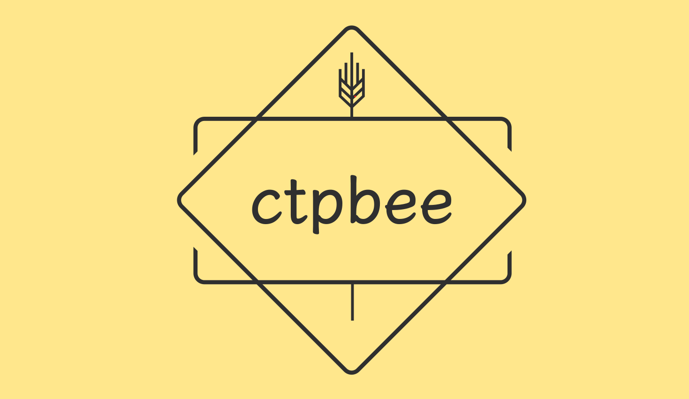
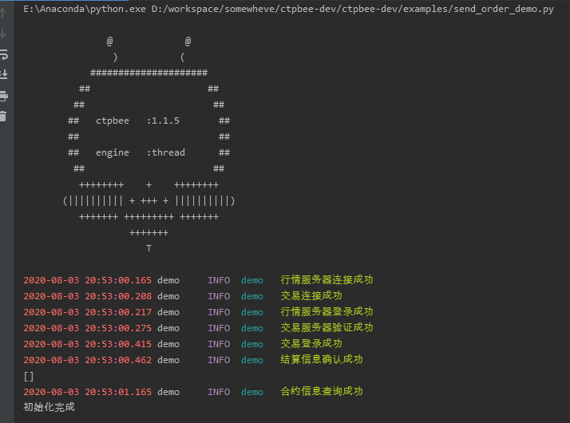
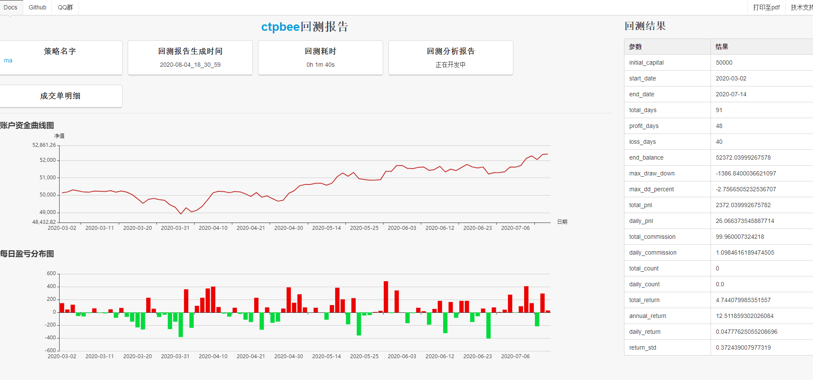

# ctpbee


[](https://pypi.org/project/ctpbee/)
[](https://app.travis-ci.com/ctpbee/ctpbee)
[](
https://pypi.org/project/ctpbee/)
[](https://github.com/ctpbee/ctpbee/blob/master/LICENSE)

bee bee .... for developer's trading ~
> tiny but strong

`ctpbee` provide a micro core of trading, you can make trade and backtest in it.

## 环境设置

```bash
#  linux用户快速生成中文支持/ windows用户无须设置 
## for root 
bee init-locale 
## for user, xxx为你的用户密码, 注意你当前用户需要拥有sudo权限 
bee init-locale --password xxxxx 

```

## 灵感起源

使用来自于[vnpy](https://github.com/vnpy/vnpy)的交易接口, 重新提供上层封装API, 简化安装流程, 提供快速实现交易功能.

## 快速安装

> `mac`用户注意， `ctpbee_api`目前仅仅提供源码安装方式，
> 需要你预先安装ctpbee_api, [安装参见](https://github.com/ctpbee/ctpbee_api)

```bash


# python version: 3.6+


# 源码安装 
git clone https://github.com/ctpbee/ctpbee && cd ctpbee && python3 setup.py install  

# pip源安装
pip3 install ctpbee
```

### 支持系统

- [x] Linux
- [x] Windows
- [x] MacOS

## 文档与交流

[文档地址](http://docs.ctpbee.com)

## 快速开始

```python
from ctpbee import CtpBee
from ctpbee import CtpbeeApi
from ctpbee.constant import *


class CTA(CtpbeeApi):
    def __init__(self, name):
        super().__init__(name)

    def on_init(self, init: bool) -> None:  # 初始化完成回调 
        self.info("init successful")

    def on_tick(self, tick: TickData) -> None:
        print(tick.datetime, tick.last_price)  # 打印tick时间戳以及最新价格 

        # 买开
        self.action.buy_open(tick.last_price, 1, tick)
        # 买平
        self.action.buy_close(tick.last_price, 1, tick)
        # 卖开
        self.action.sell_open(tick.last_price, 1, tick)
        # 卖平 
        self.action.sell_close(tick.last_price, 1, tick)

        # 获取合约的仓位
        position = self.center.get_position(tick.local_symbol)
        print(position)

    def on_realtime(self):
        pass

    def on_contract(self, contract: ContractData) -> None:
        if contract.local_symbol == "rb2205.SHFE":
            self.action.subscribe(contract.local_symbol)  # 订阅行情 
            print("合约乘数: ", contract.size)


if __name__ == '__main__':
    app = CtpBee('ctp', __name__)
    info = {
        "CONNECT_INFO": {
            "userid": "",
            "password": "",
            "brokerid": "",
            "md_address": "",
            "td_address": "",
            "appid": "",
            "auth_code": "",
            "product_info": ""
        },
        "INTERFACE": "ctp",
        "TD_FUNC": True,  # Open trading feature
    }
    app.config.from_mapping(info)  # loading config from dict object
    cta = CTA("cta")
    app.add_extension(cta)
    app.start() 
```

## 功能支持

- [x] 简单易用的下单功能
- [x] 仓位盈亏计算
- [x] 多周期多合约回测
- [x] 实时行情
- [x] k线生成
- [x] 回测报告生成
- [x] 自动运维
- [x] 插件系统的支持
- [x] 多交易接口支持
    - `ctp`
    - `ctp_mini`
    - `rohon`
    - `open_ctp`

更多相关信息, 请参阅[文档](http://docs.ctpbee.com)

## 命令行运行效果



## 回测截图

支持多周期多合约回测, 回测参考`example/backtest`示例


## 简单策略示例
- [atr](examples/strategy/atr_strategy.py)
- [bollinger](examples/strategy/bollinger_strategy.py)
- [double_ma](examples/strategy/double_ma.py)
- [macd](examples/strategy/macd_strategy.py)
- [rsi](examples/strategy/rsi_strategy.py)

## 模拟交易测试

本项目推荐使用[openctp](https://github.com/openctp/openctp) 或者[simnow](https://www.simnow.com.cn/)做模拟交易测试

> 关于如何对接`openctp`,请参阅此教程[click here](source/openctp.md)


`DEMO`: 推荐参阅[openctp分发实现](examples/openctp)

## 遇到问题?

请提交`issue`或者于`issue`搜索关键字, 或者查阅[此处](http://docs.ctpbee.com/error.html)

## 历史数据支持

> 对于本地数据自动运维方案, 请👉 [Hive](https://github.com/ctpbee/hive)
> 本项目不提供直接的历史数据访问服务.

## 插件支持

`ctpbee`提供了一个`ToolRegister`机制以支持访问数据触发机制, 可以实现交易各类插件.

欢迎各位大佬参与开发进来. 实现相关生态功能.
如果有相关疑惑, 可以发送邮件到`somewheve@gmail.com`寻求技术支持.
下面是提供的插件列表

- [ctpbee_kline](https://github.com/ctpbee/ckline) k线支持插件

## 免责声明

本项目维护时间不定期, 开源仅作爱好, 请谨慎使用. 本人不对代码产生的任何使用后果负责.
为了功能完整性考虑 推荐以下框架

- [quantaxis](https://github.com/QUANTAXIS/qautlra-rs/) `使用rust构建的交易系统`
- [vnpy](https://github.com/vnpy/vnpy)    `python里面最出名的量化交易框架 具备各种完善功能`
- [wondertrader](https://github.com/wondertrader/wondertrader) `使用c++构建的量化交易系统 同时具备python使用前端`
- [tqsdk](https://github.com/shinnytech/tqsdk-python) `信易科技出品 由异步作为运行时构建的量化交易框架`

## License

- MIT
