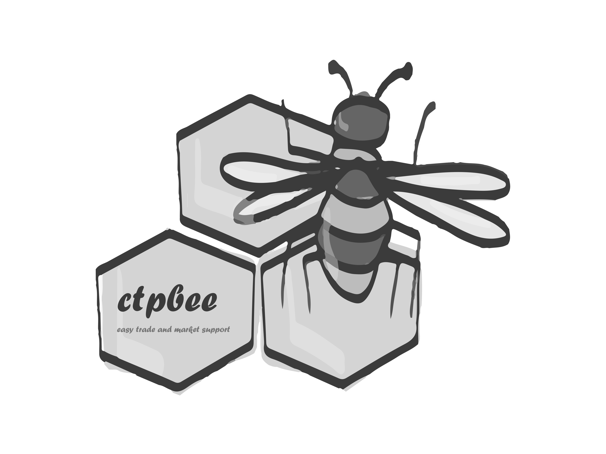

欢迎来到Ctpbee的文档
==================================

bee bee .... there is an industrious bee created ~~
ctpbee 提供了一个可供使用的微小的交易核心, 你可以通过这个核心来构建值得信赖的工具， 当然这需要你的编程功力。 你所需要关心的是如何编程来处理行情和交易信息即可。

ctpbee界面主要依赖于flask, 文档请移步

     `flask文档 <http://flask.pocoo.org/>`_

用户导航
=================================
.. toctree::
    :maxdepth: 2
    :caption: 目录

    快速开始
    申请穿透式
    教程/首页
    配置文件
    数据载体
    函数
    策略以及数据录入
    风控
    Action模块
    回测系统
    日志模块

.. toctree::
    :maxdepth: 2
    :caption: 相关

    github <https://github.com/ctpbee/ctpbee>
    社区支持 <http://community.ctpbee.com>
    加入讨论 <https://jq.qq.com/?_wv=1027&k=5xWbIq3>

.. toctree::
    :maxdepth: 2
    :caption: 相关

API支持
---------------------
如果你正在寻找一些有趣的实现, 这部分的文档对你可能有用

..  toctree::
    :maxdepth: 2

    API支持

灵感来源
-------------------
    `vnpy <http://vnpy.com/>`_  和 `flask <http://flask.pocoo.org/>`_ 感谢开源

维护的可用工具名单
------------------

`web客户端 <https://github.com/ctpbee/ctpbee_client>`_

开源贡献与准则
------------------
ctpbee主要面对开发者, 策略以及指标等工具都以ctpbee_** 形式发布. 地址在  `https://github.com/ctpbee <https://github.com/ctpbee>`_  ctpbee只提供最小的内核. 本人崇尚开源, 无论你是交易者还是程序员, 只要你有新的想法以及对开源感兴趣, 基于ctpbee 开发出新的可用工具后. 请联系我, 我会加入上述工具列表.

搜索
------------------

* :ref:`search`

